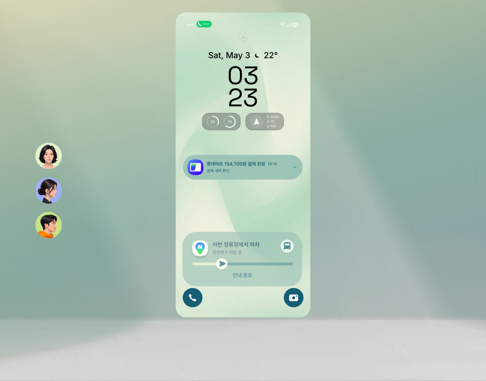
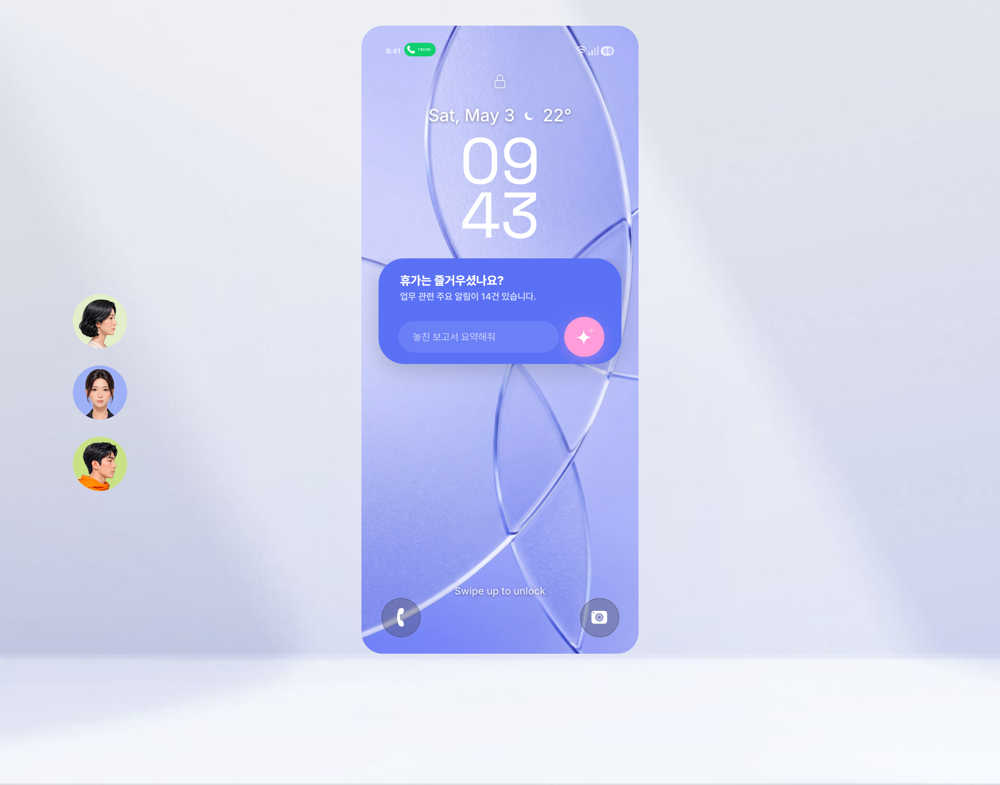
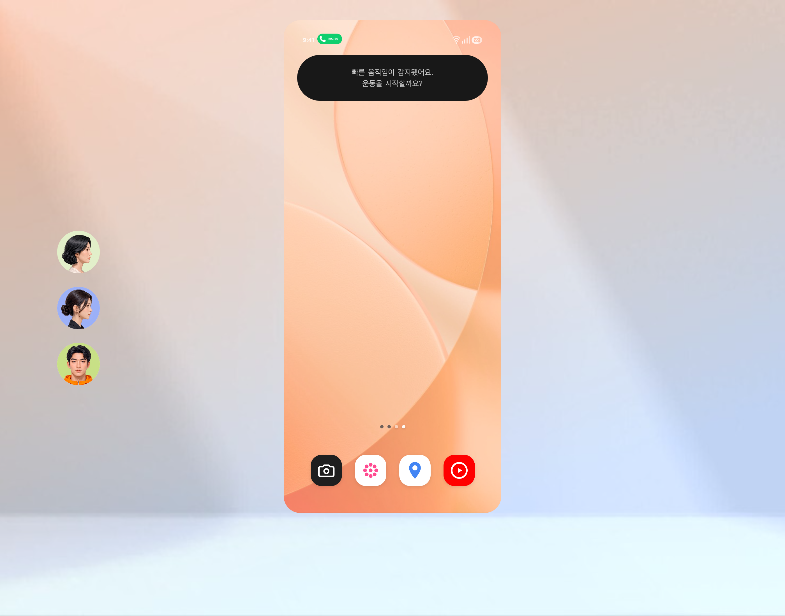

# Samsung One UI GenUI — MLP Prototype

Next.js 기반 Samsung One UI 8.5 GenUI MLP 프로토타입입니다. 페르소나별 시나리오 3종(test1, test2, test3)이 페이지로 분리되어 있고, 각 페이지는 휴대폰 캔버스 위에서 인트로 → 홈 → 위젯 인터랙션을 보여줍니다.

## 페이지

| URL | 페르소나 | 시나리오 |
|---|---|---|
| [/test1](http://localhost:4000/test1) | Persona 1 — Junseo (32, Office Worker) | Lock screen — 출퇴근 정산 · 환승 알림 · 음악 위젯 |
| [/test2](http://localhost:4000/test2) | Persona 2 — Yujin (28, Designer) | Lock screen — AI 어시스턴트 프롬프트 + 추천 |
| [/test3](http://localhost:4000/test3) | Persona 3 — Minho (29, Marathon Runner) | Lock screen — 빠른 움직임 감지 → Running Now |

### test1


### test2


### test3


## Setup

### 1. Clone

```bash
git clone https://github.com/qshim/mlp-prototype.git
cd mlp-prototype
```

### 2. Install dependencies

이 프로젝트는 **Yarn 4**(Berry) + **Corepack**을 사용합니다. Node 18 이상 필요.

```bash
# Corepack이 활성화되어 있지 않으면 한 번만:
corepack enable

# 의존성 설치
yarn install
```

처음 install은 ~1분 정도 걸립니다 (Next.js 16, Turbopack, sharp 등).

### 3. 환경 변수 (`.env.local`)

프로젝트 루트(`mlp-prototype/`)에 `.env.local` 파일을 만들고 아래 키 중 사용할 것만 채워주세요.

```bash
# test3 음악 카드의 LLM 곡 추천용 (없으면 curated fallback 사용)
OPENAI_API_KEY=sk-...

# 선택: 다른 OpenAI 모델 / 베이스 URL을 쓰려면
# OPENAI_BASE_URL=https://api.openai.com/v1
# OPENAI_MODEL=gpt-4o-mini
```

> **참고:** `OPENAI_API_KEY`가 없어도 앱은 정상 동작합니다. test3 음악 카드는 curated fallback 트랙(`Jim Hall · Concierto`)을 보여줍니다. test3 날씨 카드는 Open-Meteo 무료 API라 키 불필요.

### 4. Dev server 실행

```bash
yarn dev --port 4000
```

기본 포트는 4000으로 설정했습니다. 다른 포트를 쓰려면 `--port 3000` 등으로 변경하세요.

콘솔에 다음 메시지가 뜨면 준비 완료:

```
▲ Next.js 16.x.x (Turbopack)
- Local:    http://localhost:4000
- Network:  http://192.168.x.x:4000
✓ Ready in ~300ms
```

브라우저에서 위 페이지 표 링크 중 아무거나 열어보세요.

## 폴더 구조

```
.
├── components/
│   ├── prototype/        ← MLP 페이지 컴포넌트 (MlpTestPage.js 등)
│   └── test3/            ← test3 전용 컴포넌트 (BorderGlow, GradientText 등)
├── pages/
│   ├── test1.js          ← /test1
│   ├── test2.js          ← /test2
│   ├── test3.js          ← /test3
│   ├── prototype.js      ← /prototype (MLP 타일 + glance 카드)
│   ├── theme.js          ← /theme (테마 갤러리 + 커스터마이저)
│   └── api/
│       ├── p3/music.js   ← OpenAI 곡 추천 프록시
│       └── p3/weather.js ← Open-Meteo 날씨 프록시
├── public/
│   ├── app/              ← prototype 로직 (surface-layout.js, atomics.js 등)
│   ├── assets/test1..3/  ← 페이지별 자산 (PNG, SVG)
│   ├── background/       ← 배경 이미지
│   └── mp4/              ← 데모 mp4 (t1, t2, t3)
├── styles/
│   ├── theme-page.css    ← 메인 스타일시트 (~37k줄)
│   └── globals.css
├── lib/                  ← 테마/프로토타입 데이터 유틸
├── scripts/              ← 패치/싱크 스크립트 (PowerShell + Node)
└── docs/screenshots/     ← README용 스크린샷
```

## 기술 스택

- **Framework:** Next.js 16 (Pages Router) + Turbopack
- **React:** 19
- **Styling:** Plain CSS (`<style jsx>` + global `theme-page.css`)
- **Animation:** CSS keyframes + transforms (일부 Framer Motion)
- **Map:** Leaflet 1.9.4 (CartoDB DarkMatter 타일, hue-rotate 필터로 navy blue 튠)
- **Variable fonts:** Inter (`wght` axis), SamsungNrDefault-V6

## 자주 쓰는 명령

```bash
yarn dev --port 4000     # dev server
yarn build               # production build
yarn start               # production server
```

## Troubleshooting

**`yarn install`에서 lockfile 에러:**

```
Internal Error: ... This package doesn't seem to be present in your lockfile
```

→ Yarn 4 (Berry)를 쓰고 있는지 확인하세요. Corepack 활성화 후 재시도:

```bash
corepack enable
corepack prepare yarn@4 --activate
yarn install
```

**dev server 부팅 후 페이지가 404:**

→ 포트 4000을 다른 앱이 점유 중일 수 있습니다.

```bash
lsof -ti:4000 | xargs kill
yarn dev --port 4000
```

**브라우저에서 `OPENAI_API_KEY` 없이 음악 카드가 빈 상태:**

→ 정상입니다. `.env.local`에 키를 추가하거나 curated fallback이 표시되길 기다리세요 (~5초).

## License

내부 프로토타입.
